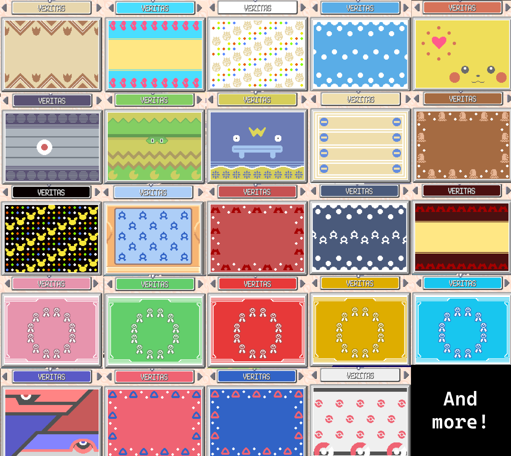

# Custom PC Box Wallpapers Feature

## Overview

This pull request adds 29 new custom PC Box wallpapers organized into 7 themed categories. The wallpapers use the existing Walda-style rendering system (patterns + icons + 2 custom colors) but with pre-configured values, making them accessible without needing to know Walda phrases.

## Features

### New Wallpaper Categories

| Category | Wallpapers | Unlock Condition |
|----------|------------|------------------|
| **Pokemon 1** | Zigzagoon, Luvdisc, Togepi, Azumarill, Pikachu, Dusclops | Catch 100 Pokemon |
| **Pokemon 2** | Ludicolo, Whiscash, Minun, Plusle, Diglett, Pichu | Catch 200 Pokemon |
| **Team** | Aqua 1, Magma 1, Aqua 2, Magma 2 | Complete Team Aqua Hideout |
| **Contest** | Cute, Smart, Cool, Tough, Beauty | Receive Pokeblock Case |
| **Legends** | Legendary, Latias, Latios | Catch Latias or Latios |
| **Other** | Block, Pokecenter, Circles | Always available |
| **Secret** | Exclsior, Veritas | Defeat Pokemon Trainer Exclsior |

### Menu Structure

- Access via: PC Box > Wallpaper > **Special**
- Categories unlock progressively as players complete in-game milestones
- The "Other" category is always available from the start
- When debug mode is enabled (`TX_DEBUG_SYSTEM_ENABLE = TRUE`), all categories are unlocked

### Technical Implementation

- Uses the existing Walda wallpaper rendering system (no new graphics needed)
- Each wallpaper is configured with:
  - Pattern ID (0-15)
  - Icon ID (0-29)
  - Background color (RGB555)
  - Foreground color (RGB555)
- Wallpaper configurations stored in `sSpecialWallpapers` array in `wallpapers.h`

## Files Changed

### Core Implementation
- `src/data/wallpapers.h` - Added wallpaper enum entries, title colors, and SpecialWallpaperConfig struct/array
- `src/pokemon_storage_system.c` - Added menu handling, category unlock logic, and special wallpaper rendering

### Strings
- `src/strings.c` - Added display strings for categories and wallpaper names
- `include/strings.h` - Added string declarations

### Documentation
- `docs/CUSTOM_WALLPAPERS.md` - Comprehensive guide for adding custom wallpapers (NEW)

## Unlock Flags Used

| Unlock | Flag/Function |
|--------|---------------|
| 100 Pokemon | `GetNationalPokedexCount(FLAG_GET_CAUGHT) >= 100` |
| 200 Pokemon | `GetNationalPokedexCount(FLAG_GET_CAUGHT) >= 200` |
| Aqua Hideout | `FLAG_HIDE_AQUA_HIDEOUT_B2F_SUBMARINE_SHADOW` |
| Pokeblock Case | `FLAG_RECEIVED_POKEBLOCK_CASE` |
| Latias/Latios | `FLAG_CAUGHT_LATIAS_OR_LATIOS` |
| Exclsior Battle | `FLAG_DEFEATED_EXCLSIOR` |

## Compatibility

- No save structure changes
- No new graphics assets required
- Uses existing Walda wallpaper patterns and icons
- Backwards compatible with existing saves

