

  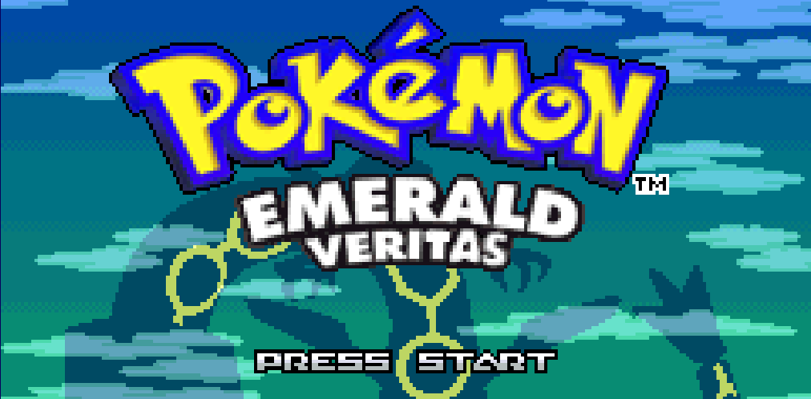

# Pokémon Emerald Veritas

**Pokémon Emerald Veritas** aims to be the **ultimate Hoenn experience** in a single ROM. The goal isn't to remake one specific Hoenn game — it's to capture how the *whole* Hoenn era felt, so that fans of Ruby, Sapphire, Emerald, FireRed/LeafGreen, and any other game from that period can come back to one cartridge and find what they remember. Built on top of that, the multiplayer side has been completely rebuilt because **playing this game with friends should feel as good as playing it alone**.

## About This Project

Veritas pulls from across the Hoenn era. The title screen and intro cycle through Ruby/Sapphire/Emerald cinematics. The player can switch between Emerald and Classic (RS) sprite styles at any time and unlock 27 alternate clothing palettes from Fashionista NPCs scattered across the region — themed after Johto starters, Kanto/Johto trainers, legendary motifs, team paths, and Hoenn classics. Music includes original Emerald tracks, FRLG ports for the Veritas-specific link rooms and boss fights, and a couple of Gen 2 themes for the trade and record rooms. After your first save, the title screen rotates Groudon and Kyogre alongside Rayquaza. A handful of shinies (Hoenn legendaries, starters, and a few common encounters) have been redesigned because the vanilla recolors were *visually* boring — that's a polish detail, not the point of the hack.

The *real* reason Veritas exists is the multiplayer side, and that one's personal.

I grew up in Brazil where almost nobody around me had a Game Boy. Most of my time with these games was solitary, but the rare times I *did* get to interact with another kid's cartridge stuck with me forever. A traded Pokémon carrying somebody else's OT on the summary screen. Their secret base showing up inside my game after we mixed records, decorated exactly the way they'd wanted it. Even just knowing that a small piece of someone else's journey was living quietly inside my own cartridge — that felt like magic to me. It still does.

So when I started building Veritas I put the link features right at the center of the hack. Every system that lets a friend leave a fingerprint on your save — secret bases, record mixing, traded Pokémon, link battles — got rebuilt to be cleaner, easier to actually use, and more memorable. Records mix automatically after a wired battle so nobody has to trek back to the Pokémon Center. Secret base battles can be doubles with their own VS cutscene and music selection. Wireless minigames give real prizes and live in two places now. Lv50 cable modes let you battle a friend regardless of where each of you is in your respective stories. The full breakdown is in the **[Multiplayer & Link Features](#multiplayer--link-features)** section below — it's the longest section of this README for a reason.

If you're playing solo this is a polished Emerald with a lot of QoL and post-game content. If you're playing with friends, this is the version I wish I'd had.

The single-player experience is tuned to be approachable for casuals while still rewarding experienced players: shiny odds get a generous re-roll system, EVs and IVs are easier to manage, level cap and Nuzlocke options are built in, and post-game encounters are reworked into proper boss fights. Some of base Emerald Enhanced's more fiddly tools (gift shinies, stat editor, dive speed) have been removed to keep the experience consistent across players.

This is my first ROM hack and it's an active project — suggestions and feedback are very welcome.

### Credits

Veritas stands on the shoulders of two excellent projects without which it would not exist:

- **[Pokémon Emerald Legacy Enhanced](https://github.com/Exclsior/Pokemon_Emerald_Legacy_Enhanced)** by **[Exclsior](https://github.com/Exclsior)** — the direct parent of Veritas. Supplied the modernized engine, the shiny re-roll framework, the level cap and Nuzlocke systems, the bag categorization base, and many of the QoL systems Veritas extends.
- **[Pokémon Emerald Legacy](https://github.com/cRz-Shadows/Pokemon_Emerald_Legacy)** by **TheSmithPlays** and the Legacy team — the foundation Enhanced itself was built on.

#### Special Thanks

🙏 **Huge thanks to [Exclsior](https://github.com/Exclsior)** for personally helping me through countless questions while I was building this hack — answering decomp questions, pointing me at the right files, debugging tricky systems, and being generous with their time as I learned. Veritas only exists in the form it does because Exclsior was patient with a first-time ROM hacker.

Veritas is a sister project to Legacy and Enhanced, not a fork-with-tweaks. Most of the systems have been rewritten or extended for the multiplayer focus and the Hoenn-essence direction, but every line of base code I started from came from those two projects, and full credit for that work belongs to their authors.

**Base Version**: Emerald Legacy Enhanced v1.1.4

## Download and Play

* To set up the repository, see [INSTALL.md](INSTALL.md).
* For patching instructions, see the original [Emerald Legacy Enhanced README](https://github.com/Exclsior/Pokemon_Emerald_Legacy_Enhanced#download-and-play).

## What's New in Veritas

This fork includes (almost) all features from Pokémon Emerald Legacy Enhanced (see [Base Features](#base-features-from-emerald-legacy-enhanced) below), plus the following additions and changes:

### Multiplayer & Link Features

The reason Veritas exists. Vanilla Emerald has a *lot* of multiplayer content (link battles, secret bases, record mixing, contests, three wireless minigames, the Battle Frontier multi room) but most of it is awkward to actually use with friends. Veritas reworks the whole link path so everything just works.

#### Auto Record Mixing After Link Battles

* After any wired 1v1 link battle, records (secret bases, TV shows, PokéNews, daily events, etc.) **mix automatically** before disconnecting — no more walking back to the Pokémon Center 2F to mix manually.
* The Pokémon Center 2F shows a **"Records mixed!"** confirmation message on exit, or **"An error occurred while mixing records"** with a 30-second graceful timeout if something hangs.
* Multi (4-player) link battles also auto-mix records on exit.
* Fixes the long-standing wireless record mixing exit hang.

#### Battle Music Selection

* Pick the music for your link battles and secret base battles before the fight starts. Available tracks include VS Rival, VS Gym Leader, VS Champion, VS Elite Four, VS Legendary Beast, VS Kyogre/Groudon, VS Regi, VS Jirachi, VS Boss (Magma/Aqua Leader), and a **"Random"** option that picks any unlocked track.
* Tracks unlock as you progress: VS Elite Four after becoming Champion, VS Regi after the three Regis, VS Jirachi after Deoxys, etc.
* Two extra unlockable tracks specific to Veritas: **"Shadow"** (FRLG Champion theme, unlocks at 150 Kanto Pokédex entries caught) and **"VS Friends"** (FRLG Gym Leader theme, unlocks at 10 link battle wins).
* Selection menu scrolls when more options are unlocked than fit on screen.

#### Secret Base Battles — Single OR Double

* When you challenge a secret base trainer, you're prompted to pick **Single Battle** or **Double Battle** instead of always being forced into single. Double mode is gated on having at least 2 usable Pokémon.
* Secret base battles also get a **VS mugshot transition** (the same dramatic intro Elite Four / Champion battles get), dynamically showing the opponent's NPC trainer sprite.
* Secret bases that exist on records you mixed with friends become full battles with proper mugshots and music selection — feels like a real boss fight.

#### Wireless Minigame Overhaul

All three wireless minigames are accessible from **both** the Mossdeep Game Corner *and* the **Direct Corner** (Pokémon Center 2F wireless lobby), with rebalanced rewards:

* **Berry Crush**: Berry Powder output **doubled** for every berry type.
* **Pokémon Jump**: Expanded prize pool unlocked by score tiers — Lucky Egg, Leftovers, Focus Band, Scope Lens, King's Rock, Up-Grade, PP Max, and **Master Ball at 20,000+ points**.
* **Dodrio Berry Picking**: No longer requires a Dodrio in your party. **All players** receive prizes (not just the winner), and rarity odds improve with more players. Prize pool includes rare berries, Nugget, Rare Candy, PP Up/Max, and Master Ball.
* See [`docs/MINIGAMES_REWARDS.md`](docs/MINIGAMES_REWARDS.md) for the full reward tables.

#### Lv 50 Cable Club Battle Modes

* The Cable Club now offers **Lv50 Singles**, **Lv50 Doubles**, and **Lv50 Multi** in addition to the standard battle modes.
* Pokémon above Lv50 are temporarily scaled down for the duration of the battle and restored to their original levels afterward — no need for a competitive box.
* Works on both wired and wireless link.

#### Outfit and Style Sharing in Link

* When you join a link battle or the Cable Club room, **other players see your unlocked outfit and Emerald/RS style** on your overworld sprite, your back/front battle pics, your Poké Ball send-out animation, and your trainer card.
* Uses an existing unused field in the link player struct, so it's fully backwards-compatible.

#### Dedicated Link Room Music

* The 2P link battle room and 4P multi battle room now play a **random FRLG track** per entry from a 4-track playlist (FRLG title screen, "Welcome to the world of Pokémon", Brendan theme, May theme) instead of the placeholder town music.
* The Record Corner and Trade Center also got dedicated themes (GSC Pewter/Saffron city theme).
* Lilycove, Mossdeep, Sootopolis, and Pacifidlog Pokémon Centers play the Crystal Comm Center theme to feel like proper hub locations for online play.

---

### Added Features

#### Randomized Intro Sequences

* Three different intro styles with equal probability (33% each):
  * **Emerald Style**: Features Flygon flying through forest scenery
  * **Ruby Style**: Features Latios flying through ocean/cloud scenery
  * **Sapphire Style**: Features Latias flying through ocean/cloud scenery
* Player sprite adapts to match intro style:
  * Flygon intro: 50% Emerald Brendan, 50% Emerald May
  * Lati intros: 50% Classic RS Brendan, 50% Classic RS May
* Dynamic background scenery and animations match selected intro style
* Fixed palette colors for all legendary Pokémon in intro sequences

#### Player Character Style Customization

* Choose between **Emerald** or **Classic** (Ruby/Sapphire) player sprite styles during new game setup
* Style selection persists through naming screen and into gameplay
* Style affects overworld sprites, battle back sprites, **bag menu sprite**, **region map/fly menu icons**, and **secret base grayscale icons**
* Style option unlocked after defeating the Elite 4 (correctly gated behind FLAG_SYS_GAME_CLEAR)

#### Outfit System

* **27 unlockable clothing palette variants** for the player character, selectable via "OUTFITS" on any PC
* Outfits change the player's colors on overworld sprites, battle sprites, trainer card, and Hall of Fame
* Outfits are unlocked by visiting **Fashionista NPCs** in 4 Pokemon Centers:
  * **Slateport** (Team Magma male) — stoic perfectionist personality
  * **Lavaridge** (Team Magma female) — bubbly and flirty personality
  * **Lilycove** (Team Aqua male) — informal graffiti artist personality
  * **Sootopolis** (Team Aqua female) — shy and cute personality
* Show Pokemon from your party to unlock outfits; some require multiple species caught in the Pokedex
* Team-restricted outfits: Magma/Groudon only from Magma NPCs, Aqua/Kyogre only from Aqua NPCs
* Passive unlocks for non-Pokemon conditions (contest wins, champion with starters, trades, etc.)
* Each Fashionista gives a daily tip about a locked outfit, with personality-flavored dialog
* **Link outfit sharing**: Other players see your outfit and Emerald/RS style in the Cable Club, during link battles, and on your trainer card

##### Outfit Previews

A small sampler of the easier outfits — show the right Pokémon to a Fashionista and they're yours.

<table>
  <tr>
    <td align="center"><b>Treecko</b> 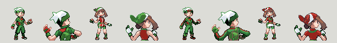</td>
    <td align="center"><b>Mudkip</b> 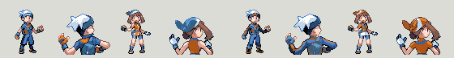</td>
  </tr>
  <tr>
    <td align="center"><b>Forest</b> 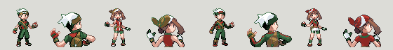</td>
    <td align="center"><b>Ocean</b> 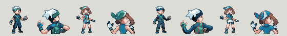</td>
  </tr>
  <tr>
    <td align="center"><b>Royal</b> 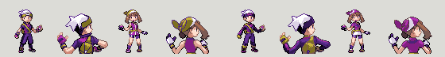</td>
    <td align="center"><b>Brazil</b> 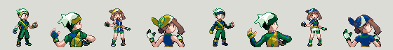</td>
  </tr>
</table>

<b>🔒 Hidden Rewards (click to expand — minor spoilers)</b>

The rare and themed unlocks. Most are tied to legendary captures, post-game milestones, team paths, or cross-game tributes. Pick your team and explore.

**Johto Starter Tributes**

<table>
  <tr>
    <td align="center"><b>Chikorita</b> 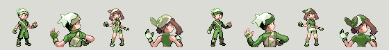</td>
    <td align="center"><b>Cyndaquil</b> 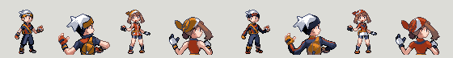</td>
  </tr>
  <tr>
    <td align="center" colspan="2"><b>Totodile</b> 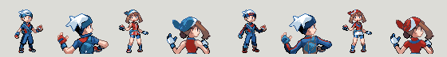</td>
  </tr>
</table>

**Legendary Themes** — earned by capturing/defeating their namesakes

<table>
  <tr>
    <td align="center"><b>Master (Lugia)</b> 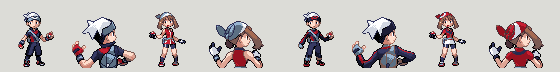</td>
    <td align="center"><b>Ho-Oh</b> 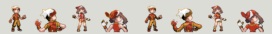</td>
  </tr>
  <tr>
    <td align="center" colspan="2"><b>Fabulous (Mewtwo)</b> 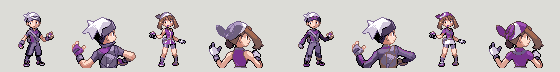</td>
  </tr>
</table>

**Team Paths** — Magma fashionistas unlock these for the volcano team, Aqua fashionistas for the ocean team

<table>
  <tr>
    <td align="center"><b>Magma</b> 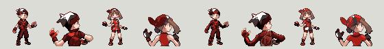</td>
    <td align="center"><b>Groudon</b> 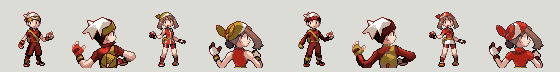</td>
  </tr>
  <tr>
    <td align="center" colspan="2"><b>Kyogre</b> 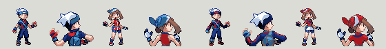</td>
  </tr>
</table>

**Cross-Game Tributes** — for the OG fans

<table>
  <tr>
    <td align="center"><b>Red (Lyra)</b> 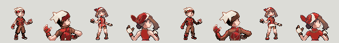</td>
    <td align="center"><b>Silver (Rocket)</b> 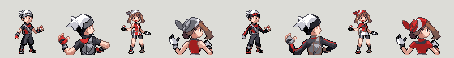</td>
  </tr>
  <tr>
    <td align="center" colspan="2"><b>Redmoon (Crystal)</b> 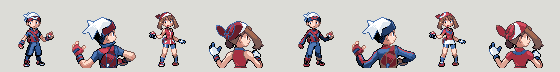</td>
  </tr>
</table>

…and several more not pictured here. Visit the Fashionistas to find them all.

The full unlockable list (27 outfits): Aqua, Brazil, Chikorita, Cyndaquil, Dark, Diver, Enigma, Fabulous, Forest, Groudon, Historic, Ho-Oh, Kyogre, Master, Magma, Mudkip, Ocean, Old, Red, Redmoon, Royal, Sakura, Silver, Torchic, Totodile, Treecko.

#### Legendary Title Screen Animation

* Added animated title screen featuring Groudon and Kyogre(Random chance after creating a Save. Without a save the Title Screen Legendary is always Rayquaza)

#### Dynamic Credits Avatars

* Credits sequence now dynamically displays player and rival sprites based on:
  * **Player's chosen gender** (male/female)
  * **Player's chosen style** (Emerald or Classic RS)
  * **Rival always displays opposite gender** with Emerald style
* Four possible combinations:
  * Emerald Brendan + Emerald May (rival)
  * RS Brendan + Emerald May (rival)
  * Emerald May + Emerald Brendan (rival)
  * RS May + Emerald Brendan (rival)
* Credits timing optimized to match 2:55 soundtrack length

#### Unlockable PC Box Wallpapers

* Added 29 new custom wallpapers organized into 7 themed categories
* Wallpapers unlock progressively as you complete in-game milestones:
  * **Other**: Always available (Block, Pokecenter, Circles)
  * **Pokemon 1**: Catch 100 Pokémon (Zigzagoon, Luvdisc, Togepi, Azumarill, Pikachu, Dusclops)
  * **Pokemon 2**: Catch 200 Pokémon (Ludicolo, Whiscash, Minun, Plusle, Diglett, Pichu)
  * **Team**: Complete Team Aqua Hideout (Aqua 1, Aqua 2, Magma 1, Magma 2)
  * **Contest**: Receive the Pokéblock Case (Cute, Smart, Cool, Tough, Beauty)
  * **Legends**: Catch Latias or Latios (Legendary, Latias, Latios)
  * **Secret**: Defeat Pokémon Trainer Veritas on Southern Island — requires both Latios and Latias caught or defeated, plus Zinnia defeated (Exclsior, Veritas)
* Access special wallpapers via PC Box > Wallpaper > Special menu
* For developers: See `docs/CUSTOM_WALLPAPERS.md` for adding new wallpapers

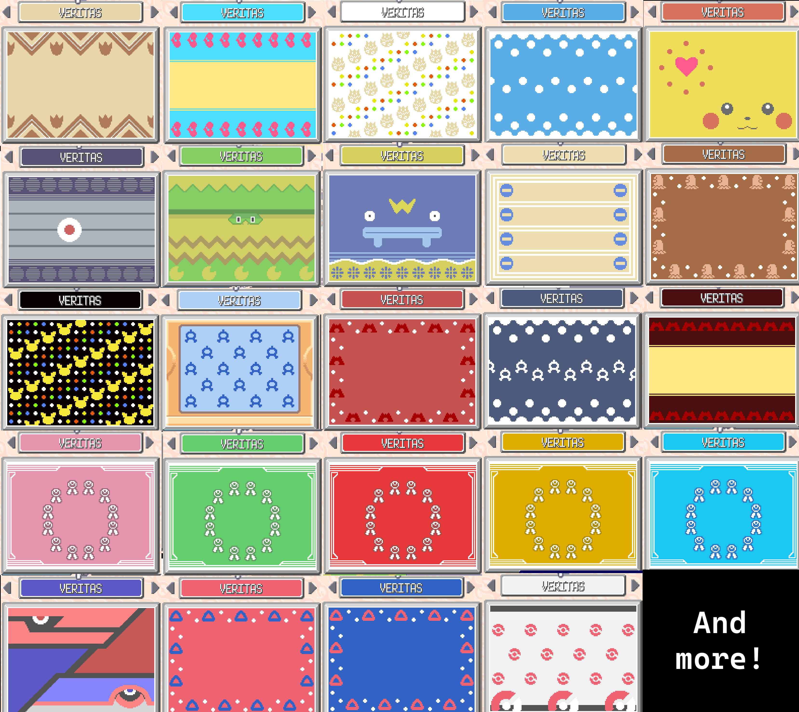

#### Trade Evolution Changes

Trade evolutions have been restored while keeping alternative evolution methods for solo players:

**Pure Trade Evolutions** (Trade OR Level 70):
* Kadabra → Alakazam
* Machoke → Machamp
* Graveler → Golem
* Haunter → Gengar

**Trade-Item Evolutions** (Trade with Item OR Use Item at Level):
| Pokémon | Evolution | Trade Item | Item Use Level |
|---------|-----------|------------|----------------|
| Poliwhirl | Politoed | King's Rock | Lv60+ |
| Slowpoke | Slowking | King's Rock | Lv60+ |
| Onix | Steelix | Metal Coat | Lv60+ |
| Seadra | Kingdra | Dragon Scale | Lv60+ |
| Scyther | Scizor | Metal Coat | Lv60+ |
| Porygon | Porygon2 | Up-Grade | Lv40+ |
| Clamperl | Huntail | Deep Sea Tooth | Lv60+ |
| Clamperl | Gorebyss | Deep Sea Scale | Lv60+ |

*This allows players to evolve Pokémon through trading (original method) or wait until higher levels for solo play.*

#### True Shiny Indicator

* Shinies that were determined on the very first roll (without needing Shiny Charm re-rolls) are marked as **true shinies**
* True shinies display **white sparkles** when entering battle, distinguishing them from charm-assisted shinies which show the normal gold sparkles
* The marking is stored within existing unused Pokémon data bits — no save structure changes
* Existing Pokémon are unaffected; only newly generated Pokémon going forward are tracked

#### Battle Music Selection

* Choose your preferred battle music before link battles and secret base NPC battles
* Available tracks include VS Rival, VS Gym Leader, VS Champion, VS Elite Four, VS Legendary Beast, VS Kyogre/Groudon, VS Regi, VS Jirachi, and VS Boss (Magma/Aqua Leader)
* VS Elite Four unlocks after becoming Champion; VS Regi unlocks after defeating all three Regis; VS Jirachi unlocks after defeating Deoxys; VS Boss unlocks after all 8 badges
* Selection of "Random" picks a random unlocked track
* Menu scrolls when more options are unlocked than fit on screen
* Default option uses the original trainer ID-based music selection

#### Steven's Beldum Gift

* The gift Beldum in Steven's house now has "STEVEN" as its OT name, male OT gender, and a unique trainer ID
* Makes the Beldum feel like a genuine gift from Steven rather than a self-caught Pokémon

#### Champion Exclsior (Post-Game)

* After becoming Champion, there is a 20% chance of encountering Exclsior instead of Wallace
* Uses Red's trainer pic and the Veritas battle theme
* Team consists of six Lv80 Pokémon: Typhlosion, Breloom, Scizor, Gardevoir, Tyranitar, and a shiny Latios
* Defeating Exclsior warps directly to the Hall of Fame

#### Secret Base VS Cutscene

* Secret base battles now show a VS mugshot transition (like Elite Four and Champion battles)
* The mugshot dynamically displays the opponent's NPC trainer sprite

#### Secret Base Battle Mode Choice

* When challenging a secret base trainer, a prompt lets you choose between **Single Battle** or **Double Battle**
* Selecting Double Battle checks that you have at least 2 usable Pokemon before proceeding

#### Muddy Water Buff

* Muddy Water base power increased from 85 to 95
* Mudkip now learns Muddy Water at level 50

#### Egg Move Tutor Price

* Egg Move Tutors (Fallarbor Town and Artisan Cave) now charge a **Nugget** or **Pearl** per move taught
* Works like the Move Relearner's Heart Scale payment — bring either item to learn an egg move

#### Morph Powder

* A new item that changes a Pokémon's displayed gender
* Found as a 5% held item on wild **Ditto** (alongside 5% Metal Powder)
* Uses the Metal Powder icon with a light blue palette
* Usable from the bag on any gendered Pokémon — genderless species are unaffected
* The change is stored within existing unused Pokémon data bits — no save structure changes
* Safe for trading and Pokémon Box — other games simply ignore the flag and show the original gender

#### Wild Held Item Changes

* **Clamperl**: 35% chance to hold a Pearl (rare slot is 50/50 Deep Sea Scale or Deep Sea Tooth)
* **Spoink**: 35% chance to hold a Pearl
* **Staryu**: 35% chance to hold a Pearl (replaces Stardust; Star Piece remains as rare)
* **Zigzagoon**: 5% chance to hold a Nugget
* **Ditto**: 5% chance to hold Morph Powder, 5% chance to hold Metal Powder

#### Pokemon League Lobby Music

* The Pokemon League 1F lobby now plays the Victory Road theme instead of the Poke Center theme

#### Hard Mode: Switch/Set After Champion

* Hard mode no longer permanently forces SET battle style
* Players who have beaten the Champion can toggle between Switch and Set
* Nuzlocke mode still always forces SET

#### Wireless Minigame Reward Overhaul

All three wireless minigames have been improved with better rewards and are now accessible from **both** the Mossdeep Game Corner and the **Direct Corner** (Pokemon Center 2F wireless lobby):

* **Berry Crush**: Berry powder output **doubled** for all berry types
* **Pokemon Jump**: Expanded prize pool unlocked by score tiers — includes Lucky Egg, Leftovers, Focus Band, Scope Lens, King's Rock, Up-Grade, PP Max, and Master Ball (at 20,000+ points)
* **Dodrio Berry Picking**: No longer requires a Dodrio in the party. **All players** now receive prizes (not just the winner), with rarity odds improving with more players. Prize pool includes rare berries, Nugget, Rare Candy, PP Up/Max, and Master Ball
* Shiny Dodrio in your party still makes the in-game Dodrio shiny

See `docs/MINIGAMES_REWARDS.md` for full reward tables and details.

#### Legendary Overworld Sprite Fix

* All static legendary encounters now use their dedicated original sprites instead of HGSS follower sprites
* Applies to: Articuno, Zapdos, Moltres, Mewtwo, Raikou, Entei, Suicune, Lugia, Ho-Oh, Celebi, Latios, Latias, Regirock, Regice, Registeel

#### Legendary Encounter Rework

* Legendary encounters have higher levels and custom movesets for a greater challenge. The exact levels and movesets are hidden below to avoid spoiling the fights.

<b>🔒 Show legendary levels & movesets (spoilers)</b>

* **Regi trio** (Lv65): Ancient Power, Lock On + signature OHKO move + Rest/Zap Cannon
* **Kanto birds** (Lv70): Full offensive movesets with signature moves
* **Johto beasts** (Lv70): Competitive movesets with coverage moves
* **Mewtwo** (Lv80): Calm Mind, Thunderbolt, Psychic, Amnesia
* **Deoxys** (Lv85): Psycho Boost, Hyper Beam, Superpower, Recover
* **Jirachi** (Lv30): Psychic, Refresh, Doom Desire, Rest
* **Rayquaza** (Lv70): Rest, ExtremeSpeed, Outrage (no longer knows Fly at encounter)

#### Daycare Egg to PC

* When your party is full, daycare eggs are automatically sent to a PC box instead of being rejected
* Displays which box the egg was sent to
* If PC boxes are also full, the egg stays at the daycare

#### Lottery Corner Improvement

* Lowered the matching threshold from 2 digits to 1 digit, making the lottery more accessible

#### Mirage Island Rework

* Post-Elite 4: increased Mirage Island appearance odds (~4.6%/day with a full party)
* Pre-Elite 4: lower odds (~0.29%/day with a full party)
* Having a **Wynaut** in your party always grants access
* Post-Elite 4: having **Mew**, **Celebi**, or **Jirachi** also grants access
* Mirage Island now has a 6% chance to encounter **Kanto and Hoenn starters** (Bulbasaur, Charmander, Squirtle, Treecko, Torchic, Mudkip) at level 5

#### Categorized Bag Pockets

* The Items pocket is split into 4 sub-categories for easier navigation:
  * **Items**: General items (Repels, Escape Rope, Evolution Stones, etc.)
  * **Medicine**: Healing items, PP restoring items, stat boosters (X Attack, etc.), Rare Candy, Sacred Ash
  * **Hold Items**: Held items, evolution hold items (King's Rock, Metal Coat, etc.), and Mail
  * **Treasures**: Sell-only items with no field/battle/hold use (Nugget, Pearl, Shards, etc.)
* Total of 8 bag pockets: Items, Medicine, Poke Balls, Battle Items, Berries, Treasures, TMs/HMs, Key Items
* All items remain in the same internal storage — no save structure changes
* Sorting works across all pockets including the new sub-categories

#### Expanded Secret Base Decorations

* Maximum decorations per secret base increased from **16 to 32**
* Total number of secret bases reduced from 20 to 15 to accommodate the larger decoration data
* Old saves are automatically migrated to the new format

#### Egg Trading

* Eggs can now be traded before obtaining the National Dex

#### Light Ball Enhancement

* Light Ball now boosts Special Attack for Pikachu, Pichu, Minun, and Plusle (not just Pikachu)

#### Default Options for New Games

* **Pokémon Follower**: Now enabled by default
* **Surfing Pokémon Sprites**: Now enabled by default
* Both options remain fully toggleable in the Options Plus menu

#### Baby Pokémon Overhaul

Baby Pokémon have been reworked to be viable in battle with new abilities and compressed learnsets:

* **3 New Abilities**:
  * **Baby Charm** — Infatuates all opposing Pokémon on switch-in (bypasses gender check, blocked by Oblivious/Substitute)
  * **Quick Learner** — Boosts Attack, Sp. Attack, and Evasion by 1 stage when hit by any damaging move
  * **Mystic Tempo** — Sharply boosts a random stat by 3 stages after using Metronome
* **Stat Adjustments**: Pichu (SpA 100), Magby (SpA 110), Azurill (Atk 50, SpA 30), Cleffa (Def 73, SpD 90), Igglybuff (Def 20, SpD 25), Togepi (HP 50), Tyrogue (all stats 40), Teddiursa (Atk 95, Spd 55)
* **Compressed Learnsets**: All baby Pokémon learn their final evolution's moves before level 40
* **Ability Assignments**: Pichu/Cleffa/Igglybuff/Smoochum/Azurill/Teddiursa → Baby Charm; Magby/Elekid/Tyrogue → Quick Learner; Togepi → Mystic Tempo

### Technical Improvements

* **RNG Seeding Fix**: Enabled Real-Time Clock (RTC) based RNG seeding at boot
  * Vanilla Emerald only enables this with BUGFIX flag defined
  * Now always active, providing truly random wild encounters, shiny rolls, and other RNG-dependent events
  * Prevents RNG manipulation exploits that rely on predictable seed values
* Changed flag initialization order to prevent follower/surfer defaults from being cleared
* Improved intro scene transitions and sprite management
* **RS/Classic Player Style Animation Fix**: Fixed running animation for Classic (Ruby/Sapphire) player sprites
  * Previously, Classic style players would show a static sprite when running instead of proper animation
  * Added missing running frames to the RS sprite tables and corrected animation table assignment
* **Shadow Palette Fix**: Fixed shadow rendering for both player and follower Pokémon
  * Player shadows now correctly use the player's palette (supports RS/Emerald style switching)
  * Follower shadows explicitly load and use the Brendan palette which contains proper shadow colors
  * Fixes white/incorrect shadow colors when jumping ledges or during other animations
* **Player Style Storage Refactor**: Migrated player style storage from SaveBlock2 field to flag system
  * Now uses `FLAG_PLAYER_STYLE_RS` (flag 0x296) instead of `gSaveBlock2Ptr->playerLookStyle`
  * Avoids modifying the save structure, improving compatibility
  * Flag is properly preserved through new game initialization
* **Save Compatibility**: Automatic migration for older saves
  * Old saves using the SaveBlock2 `playerLookStyle` field are automatically migrated to the new flag system
  * Migration happens transparently when loading a save file
  * No player action required - style preference is preserved
* **Shiny Mechanics Overhaul**: Reworked shiny odds system
  * Base shiny odds: **1/8192** (vanilla rate)
  * Each Shiny Charm adds +1 re-roll attempt
  * Example: 1 charm = 1/4096, 2 charms = 1/2731, 8 charms = 1/910
  * **Breeding bonus**: Breeding two Pokémon with different Original Trainers grants +1 extra shiny roll at hatch, stacking with Shiny Charms (e.g., 3 charms + different OT = 5 rolls = ~1/1638)
* **RS Style Front Trainer Pic Fix**: VS cutscene mugshots and Hall of Fame now correctly display the Ruby/Sapphire player sprite when Classic style is selected
* **RS Style Bag Menu**: Bag menu now displays the original Ruby/Sapphire yellow bag sprite when Classic style is selected (both male backpack and female fanny pack variants)
* **Acro Bike Reverse Ledge Fix**: Fixed a bug where postgame bunny-hop ledge jumps could clip the player into walls or NPCs; landing tile is now checked for passability
* **Sprite Weather Tinting Fix**: Fixed weather palette tinting and object event spawn order
* **PokeNews Events**: PokeNews events are now available before defeating the Elite 4
* **Fast Surf Speed Reduction**: Reduced fast surfing speed by approximately 30%
  * Now uses 6-frame movement cycles instead of 4-frame cycles
  * Provides smoother surfing experience while still being faster than normal
* **Pokérus Rate Increase**: Increased Pokérus encounter rate from ~1/21845 to **1/2048**
  * Makes this beneficial mechanic more accessible to players
* **Invalid Trainer Record Cleanup**: Automatically repairs or removes corrupted link battle, trainer name, and secret base records on save load
  * Detects empty names, all-space names, and names containing control codes
  * Detects secret base trainers with invalid party species (e.g. Missingno from corrupted records)
  * When a corrupted record shares a trainer ID with a valid record, wins/losses/draws are merged into the valid record
  * Displays a notification with the number of removed records if any were cleaned
* **Surfing Weather Palette Fix**: Surfing Pokémon overworld sprites now have weather palette fade applied correctly (e.g. rain tinting on Route 119)
* **Hoenn Dex Completion Fix**: `HasAllHoennMons()` now explicitly skips Jirachi and Deoxys instead of relying on fragile index math
* **Route 119 Parasol Lady Sprite Fix**: Corrected wrong sprite used for Parasol Lady Rachel NPC
* **Norman Rematch Text Fix**: Norman's rematch phone call now correctly says "the SOOTOPOLIS GYM BADGE" instead of "all eight GYM BADGES"
* **Blaze Kick Flinch Effect**: Blaze Kick now has independent burn and flinch chances (like Fire Fang), instead of only applying burn
* **Contest Room RS Style Fix**: Contest lobby now correctly uses RS player sprites when Classic (Ruby/Sapphire) style is selected
* **Link Battle Music Fix**: Link battle music selection was being ignored — both wired and wireless battles now correctly use the player's chosen music
* **Bike Dismount Weather Fix**: Dismounting the bike on weather-affected routes (e.g., Route 119 rain) now properly restores weather effects
* **RS Style Link Battle Palette Fix**: Fixed player sprite palette mismatch during Poké Ball throw animation in link double battles when using Classic (RS) style
* **Hall of Fame Text**: Hall of Fame screen now displays "EMERALD VERITAS" instead of the base project name
* **Synchronize Fix**: Fixed Synchronize ability not working due to the shiny roll system overwriting the nature-locked personality. Synchronize now works 100% on wild encounters and static encounters while still allowing shiny rolls.
* **Berry Rain Sprite Fix**: Fixed berry tree sprites appearing bright/illuminated during heavy rain until lightning strikes. Now applies weather palette darkening when berry sprites are loaded.
* **PokeNews TV Priority**: PokeNews events (Shiny Day, Training Day) now display first when watching TV, before other shows.
* **Shiny Palette Redesigns**: Hand-tuned shiny palettes for legendaries, starters, and common route encounters, each paired with a matching overworld follower sprite.

#### Hoenn Legendary Trio

The headline shinies of Pokémon Emerald Veritas. Each of the three superancient/sky legendaries was redesigned from scratch with a distinct identity rather than the vanilla recolor.

<table>
  <tr>
    <td align="center" width="33%">
      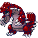 
      <b>★ Groudon ★</b> 
      The Continent Pokémon 
      Deep dark red body, glowing orange eyes, blue-purple outlines
    </td>
    <td align="center" width="33%">
       
      <b>★ Rayquaza ★</b> 
      The Sky High Pokémon 
      Darker emerald body with vivid green accents and orange eyes
    </td>
    <td align="center" width="33%">
      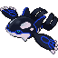 
      <b>★ Kyogre ★</b> 
      The Sea Basin Pokémon 
      Dark orca silhouette with sapphire blue line patterns and an aquamarine eye
    </td>
  </tr>
</table>

#### Other Notable Redesigns

<table>
  <tr>
    <td align="center" width="33%">
       
      <b>Shadow Lugia</b> 
      Navy body · teal frills crimson eyes · rose mouth
    </td>
    <td align="center" width="33%">
      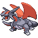 
      <b>Salamence</b> 
      Dark grey body crimson wings · red eyes
    </td>
    <td align="center" width="33%">
      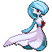 
      <b>Gardevoir</b> 
      Dark gray petal blood red eye
    </td>
  </tr>
</table>

#### Hoenn Starter Lines

<table>
  <tr>
    <td align="center" width="33%">
      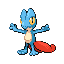 
      <b>Treecko</b> 
      Vibrant blue and red
    </td>
    <td align="center" width="33%">
      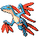 
      <b>Grovyle</b> 
      Vibrant blue and red
    </td>
    <td align="center" width="33%">
      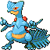 
      <b>Sceptile</b> 
      Vibrant blue and red
    </td>
  </tr>
  <tr>
    <td align="center">
      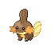 
      <b>Mudkip</b> 
      Earthen brown
    </td>
    <td align="center">
      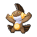 
      <b>Marshtomp</b> 
      Earthen brown
    </td>
    <td align="center">
      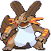 
      <b>Swampert</b> 
      Earthen brown
    </td>
  </tr>
</table>

#### Route Encounters

<table>
  <tr>
    <td align="center" width="33%">
      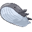 
      <b>Wailord</b> 
      Gray body bluish-white belly
    </td>
    <td align="center" width="33%">
      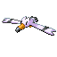 
      <b>Wingull</b> 
      Dark gray markings
    </td>
    <td align="center" width="33%">
      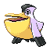 
      <b>Pelipper</b> 
      Dark gray markings
    </td>
  </tr>
  <tr>
    <td align="center">
      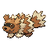 
      <b>Zigzagoon</b> 
      Brown-orange corgi
    </td>
    <td align="center">
       
      <b>Linoone</b> 
      Brown-orange corgi
    </td>
    <td align="center">
       
      <b>Spinda</b> 
      Panda
    </td>
  </tr>
</table>

* **4 Shiny Sparkle Colors**: Different sparkle effects based on how the shiny was obtained:
  * **Gold** (default): Normal shiny
  * **Light Yellow**: Shiny caught during Shiny Day event
  * **White**: True Shiny (shiny on first roll with bonus active)
  * **Light Blue**: True Shiny caught during Shiny Day

* **Shiny Day PokeNews Event**: A random TV event that gives +1 shiny roll when active. Spreads to friends via record mixing. TV announces a rare meteorological event.

* **Training Day PokeNews Event**: A random TV event with three effects when active:
  * Double EV gains from battle (stacks with Pokérus and Macho Brace)
  * Double potency for EV-reducing berries
  * Wild Pokémon guaranteed minimum 10 IVs per stat

* **Daily Event Guarantee**: At least one PokeNews event is active every day. Events trigger on encounters (not just catches) and spread via record mixing.

* **Shadow Lugia Boss Fight**: After defeating Trainer Veritas on Southern Island, inspecting the stone triggers a Lv99 shiny Lugia boss battle with Thunder, Hydro Pump, Calm Mind, and Psycho Boost. Holds White Herb. Underwater terrain with Rayquaza battle music.

* **Lv 50 Battle Modes**: Lv50 Singles, Lv50 Doubles, and Lv50 Multi battle options in the Cable Club. Pokémon above Lv50 are temporarily scaled down. Original levels restored after battle. Works on both wired and wireless.

* **Auto Record Mixing**: Wired 1v1 link battles automatically exchange records (secret bases, TV shows, PokeNews, etc.) before disconnecting.

* **Ability Changes**:
  * Lugia: Pressure → **Drizzle**
  * Ho-Oh: Pressure → **Drought**

* **Save Migration v4→v5**: Automatically wipes corrupted record mixing data (TV Shows, Dewford Trends, etc.) from older saves to fix crashes
  * Valid PokeNews events (Slateport sales, Game Corner, Lilycove sales, Blend Master) are preserved through migration
* **Southern Island Veritas Battle Fix**: Exclsior encounter now correctly requires both Latios and Latias to be caught or defeated (plus Zinnia defeated), not just one of them

### New Options Menu Items

* **Short POKéCENTER**: Added option to World menu
  * When enabled (ON): Skips the "Would you like to heal?" yes/no question at Pokémon Centers
  * When disabled (OFF): Original vanilla behavior with the yes/no prompt
  * Default is OFF (vanilla experience)

* **Devon Scope Toggle**: Added option to World menu (only visible after receiving Devon Scope)
  * When enabled (ON): Shows sparkling Feebas tiles on Route 119, 5% encounter rate on those tiles
  * When disabled (OFF): Vanilla Feebas hunting mechanics with hidden tiles, 50% encounter rate
  * Toggling this option also remixes the Feebas tile locations
  * Allows players to choose between the QoL visible tiles or the classic blind fishing experience

* **SE Volume**: Added 5-level volume control for the menu select ding sound
  * Quiet (mute), Low (25%), Medium (50%, default), High (75%), Loud (100%)
  * Backward compatible with existing saves

* **Pickup Message**: Added option to Battle menu
  * When enabled (ON): Displays a message at the end of battle when a party Pokémon picks up an item via the Pickup ability
  * When disabled (OFF): Items are picked up silently (original behavior)
  * Shows individual Pokémon name and item for single pickups, or total count for multiple

### Removed Features

#### Debug System

- Debug menu access (R+Start trigger removed)
- Debug menu option from Start menu
- All debug functionality disabled in production builds

#### Game Modes

- Removed Nuzlocke(Hardcore) mode

- Removed National Dex mode

#### Options Menu Simplifications

* **Dive Speed option** removed from Surf submenu
* **Stat Editor** fully disabled (removed from party menu and post-game dialog)
* **Button Mode simplified** - Removed "LR" mode option, now only offers "NORMAL" and "L=A" modes

#### Gift Pokémon Changes

The following gift Pokémon are **no longer guaranteed shiny** (changed from Enhanced base):

* **Eevee from Lanette** (Route114) - changed to regular encounter
* **Eevee from Trick House** (completion reward) - changed to regular encounter
* **Snorlax from Trainer Hill** (completion reward) - changed to regular encounter

Still shiny gift Pokémon (unchanged from Enhanced):

* **Beldum from Scott** (Battle Frontier Gold Symbols reward) - remains shiny
* **Latios/Latias** (Southern Island) - remains shiny

#### Contest Reward Changes

Contest painting rewards have been modified:

* **Master Beauty Contest reward** - Changed from Milotic to Ditto (Level 50)
* Other contest rewards remain unchanged:
  * Cool Contest: Slaking (Level 50)
  * Cute Contest: Delcatty (Level 50)
  * Smart Contest: Gardevoir (Level 50)
  * Tough Contest: Aggron (Level 50)

## Base Features from Emerald Legacy Enhanced

This ROM hack includes **all features** from Pokémon Emerald Legacy Enhanced v1.1.4, including:

* **All Pokémon Emerald Legacy features** (improved story, better trainer battles, expanded post-game)
* **Pokémon Followers** with shiny support
* **Unique Surfing Sprites** per Pokémon
* **Optional National Dex Mode** (all 9 starters available from start)
* **HM Improvements** (no need to teach HMs, just have them in bag)
* **Shiny Charms** (up to 8 available through in-game milestones)
* ~~**Stat Editor** (IV/EV editing after National Dex)~~ — Disabled in Veritas
* **Nature Mints** & **Ability Capsules**
* **Egg Move Tutor** (post-game)
* **EXP. All** (Gen 3 style party-wide exp share)
* **Expanded Options Menu** with tons of customization
* And many more quality of life improvements!

For a complete list of Enhanced features, see the [full Emerald Legacy Enhanced README](https://github.com/Exclsior/Pokemon_Emerald_Legacy_Enhanced#base-patch---v114).

For details on base Emerald Legacy changes, see the [Emerald Legacy Main Doc](https://docs.google.com/document/d/1rBSuhFmiiehghr3AQ37JwBzbLCD21TXo_SWpUUXsz9k/copy).

## Credits

### Pokémon Emerald Veritas

* **Developer**: In-Veritas

### Based On

* **Pokémon Emerald Legacy Enhanced** by Exclsior and team
  * [GitHub Repository](https://github.com/Exclsior/Pokemon_Emerald_Legacy_Enhanced)
* **Pokémon Emerald Legacy** by TheSmithPlays, cRz Shadows, and the Legacy team
  * [GitHub Repository](https://github.com/cRz-Shadows/Pokemon_Emerald_Legacy)
* **pokeemerald Disassembly** by the Pret team
  * [Pret Projects](https://pret.github.io/)

### Special Thanks

* Exclsior for creating Emerald Legacy Enhanced and providing an excellent foundation
* TheSmithPlays and the entire Legacy team for Pokémon Emerald Legacy
* The Pret team for the pokeemerald disassembly
* All feature creators credited in the original Enhanced README

## Community Links

* **Pokémon Legacy Discord**: [Join Server](https://discord.gg/Wupx8tHRVS)
* **Pokémon Legacy Reddit**: [r/PokemonLegacy](https://www.reddit.com/r/PokemonLegacy)
* **Emerald Legacy Enhanced Thread**: [Discord Channel](https://discord.com/channels/1111380675837308948/1328484761148198973)

---

# Full Feature Documentation

For complete documentation of all Emerald Legacy Enhanced features, please refer to the sections below or visit the [original Enhanced README](https://github.com/Exclsior/Pokemon_Emerald_Legacy_Enhanced).

<b>Click to expand: National Dex Mode Details</b>

<b>Click to expand: Shiny Charm System</b>

Completely optional to use Shiny Charms have been added to the game. These are a "secret" feature, meaning no in-game NPCs or dialogue refer to their existence.

In-game milestones for Shiny Charm acquisition (all added to Player Item PC, max 8 available per game.):

* One from start of the game
* Beating the Game (E4 and Champion)
* Getting all Contest Artworks in Lilycove Museum
* Defeating Steven in Meteor Falls
* Completing Hoenn Pokédex (And speak to Prof. Birch)
* Completing National Pokédex (And speak to game developers in Lilycove City)
* Getting all Silver Symbols in Battle Frontier
* Getting all Gold Symbols in Battle Frontier

**Key Notes:**

* Shiny Charms will be silently awarded to the player's item PC when in-game milestones have been met.
  * do not work if left or stored in the player's item PC.
* Shiny Charms only take effect if they are in the player's bag.
* Shiny Charms cannot be tossed.
* Breeding Eggs from Daycare are impacted by Shiny Charm(s) as long as they're in the bag when you collect the egg.
* Shiny Charms can be held by Pokémon and therefore traded between different Emerald Legacy Enhanced games.
  * do not change Shiny changes if held by a Pokémon
* If migrating a save and already completed a relevant milestone, the Shiny Charm will be added to your PC, except for the Pokédex Shiny Charms which require the above noted in-game tasks to be added to the PC.

**Shiny Charm Rates (Veritas System):**

Veritas uses a re-roll system where each Shiny Charm adds +1 re-roll attempt. Base odds are 1/8192 (vanilla rate):

| Charms | Total Rolls | Odds | Percentage |
|--------|-------------|------|------------|
| 0 | 1 | 1/8192 | 0.012% |
| 1 | 2 | 1/4096 | 0.024% |
| 2 | 3 | 1/2731 | 0.037% |
| 3 | 4 | 1/2048 | 0.049% |
| 4 | 5 | 1/1638 | 0.061% |
| 5 | 6 | 1/1365 | 0.073% |
| 6 | 7 | 1/1170 | 0.085% |
| 7 | 8 | 1/1024 | 0.098% |
| 8 | 9 | 1/910 | 0.110% |

*Note: Most players will have 3 charms by end of main story (1/2048 odds).*

<b>Click to expand: Options Menu Features</b>

* Ability to enable to disable Pokémon followers.
* Ability to toggle between unique per-Pokémon surfing overworld and original "Surf blob"
* Ability to increase player and Non-player character movement speed in the world.
* Ability to enable or disable Auto Run.
  * Run without holding the B Button.
  * Hold B to walk.
* Ability to enable to disable Fast Surf.
  * Fast Surfing without holding the B button.
  * Hold B to Surf at normal speed.
* Ability to enable or disable Improved Fishing: Does not allow hooked fish to escape (disabled by default).
* Ability to change diving movement speed.
* Ability to enable or disable Bike Music.
* Ability to enable or disable Surf Music.
* Ability to swap game battle mode between Normal, Hard and Hardcore (Nuzlocke) after defeating Steven in Meteor Falls.
* Ability to change speed of HP Bar draining in battle.
* Ability to change speed of EXP Bar filling in battle.
* Ability to reduce or turn off in-battle item use animation.
* Ability to toggle Type Effectiveness colour coding within battle (Off by default).
  * Green: Super effective, Red: Not very effective, Grey: No effect.
* Ability to change in-game font from Hoenn (original Emerald font) to Kanto (FireRed/LeafGreen font).
* Ability to hide Nickname option from Party Menu.
* Ability to change Battle Mode (Normal/Hard Mode/Hardcore(Nuzlocke)) after beating Steven in Meteor Falls.
* Ability to increase player and NPC in-game speed (World Speed) by 2x, 4x, or 8x (Music speed stays the same.)
  * Holding "R" button will slow back to standard 1x speed.
    * May conflict with changing Bike type. Recommend to use Button Mode: "L = Settings" to move Bike swap.
  * **Note:** 8x Speed may have some minor visual bugs. This is due some some frames being skipped at that speed.
* Added extra "Button Modes" for the "L" button as a shortcut in the overworld when pressing the "L" button:
  * L = Settings: Will change the relevant contextual setting based on what the player is doing:
    * If walking or running, toggle Auto Run.
    * If surfing, toggle Fast Surf.
    * If diving, will step through the different diving speeds on each press.
    * If on bike and unlocked dual swapping bike in post-game, swap bikes.
      * This is as an alternate for players using the above World Speed options to be able to change bike type and use the manual slow down of holding "R". Pressing "R" in this mode does not change the bike type.
  * Pressing A+B simultaneously while on a bike also swaps bike type (post-game unlock required)
  * L = Speed: Will either step through, or toggle on/off the relevant chosen World Speed option
  * L = Fast Mode: Either toggles Auto Run, Fast Surf, World Speed and Diving speed to On or Max (as appropriate), or turns them all to Off or Minimum as appropriate.
  * L = Follower: Toggles Follower On or Off:
    * When turning off, follower will return to Pokeball immediately.
    * When toggling off, player needs to take a step for follower to spawn (if able)
  * All new above Button Modes have LR Button Mode enabled.

---

## License and Distribution

This project is based on the pokeemerald disassembly, which is a work derived from Pokémon Emerald. All rights to Pokémon and Pokémon Emerald are held by Nintendo, Game Freak, and The Pokémon Company.

This is a non-commercial fan project created for educational and entertainment purposes.
